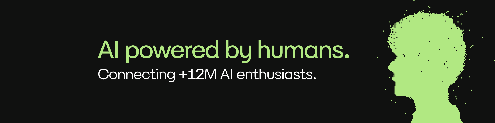

# Ultimate AI, Machine Learning & Data Science Resource Hub [100+ Curated Gems]

> The most viral AI & Data Science resource list on GitHub.
> 
> 
> If you’re building your AI career, this repo is your new homepage.
> 

---

## 🌟 Why This Repo Will 10x Your AI Journey

AI is moving **faster than anything in history** 

This repo is your **personal cheat code**: 100+ handpicked and curated resources that actually matter.

✅ **Join thousands of developers, researchers** and AI enthusiasts leveling up right now.

---

# 📚 The Hall of Awesome: 100+ Curated Resources

## 🤖 Machine Learning Roadmaps & Study Plans

1. [100 Days of ML Code (45.6k⭐)](https://github.com/Avik-Jain/100-Days-Of-ML-Code)
2. [Deep Learning - Stanford CS231N](https://www.youtube.com/watch?v=vT1JzLTH4G4&list=PLSVEhWrZWDHQTBmWZufjxpw3s8sveJtnJ&index=2)
3. [ML-For-Beginners by Microsoft (58k⭐)](https://github.com/microsoft/ML-For-Beginners)
4. [Dive into Deep Learning (39k⭐)](https://github.com/d2l-ai/d2l-en)
5. [Homemade Machine Learning (23.2k⭐)](https://github.com/trekhleb/homemade-machine-learning)
6. [Hands-On ML with Scikit-Learn, Keras, and TensorFlow](https://github.com/ageron/handson-ml3)
7. [Google Machine Learning Crash Course](https://developers.google.com/machine-learning/crash-course)
8. [Stanford CS229: ML Course](http://cs229.stanford.edu/)
9. [MIT 6.S191 Deep Learning](http://introtodeeplearning.com/)
10. [Managing ML projects - Google](https://developers.google.com/machine-learning/crash-course)

## 📊 Data Science Resources

1. [Data Science For Beginners (28.4k⭐)](https://github.com/microsoft/Data-Science-For-Beginners)
2. [Awesome Data Science (25.2k⭐)](https://github.com/academic/awesome-datascience)
3. [Data Science Masters (25.1k⭐)](https://github.com/krishnaik06/Data-Science-Masters)
4. [The Analytics Edge (MIT)](https://ocw.mit.edu/courses/sloan-school-of-management/15-071-the-analytics-edge-spring-2017/)
5. [Harvard CS109 Data Science](http://cs109.github.io/2015/)
6. [Data Science Interviews (9k⭐)](https://github.com/alexeygrigorev/data-science-interviews)
7. [Data Science Best Resources (2.9k⭐)](https://github.com/datasciencemasters/go)
8. [Kaggle Learn](https://www.kaggle.com/learn)
9. [DataCamp Free Courses](https://www.datacamp.com/)
10. [Google Data Analytics Certificate](https://www.coursera.org/professional-certificates/google-data-analytics)

## 🧠 Deep Learning & Neural Networks

1. [Deep Learning Book (Goodfellow)](https://www.deeplearningbook.org/)
2. [PyTorch Tutorials](https://pytorch.org/tutorials/)
3. [TensorFlow Tutorials](https://www.tensorflow.org/tutorials)
4. [Neural Networks and Deep Learning](http://neuralnetworksanddeeplearning.com/)
5. [CS231n: CNNs for Visual Recognition](http://cs231n.stanford.edu/)
6. [Andrej Karpathy Blog](https://karpathy.github.io/)
7. [Deep Learning - Stanford CS231N](https://www.youtube.com/watch?v=vT1JzLTH4G4&list=PLSVEhWrZWDHQTBmWZufjxpw3s8sveJtnJ&index=2)
8. [Keras Documentation](https://keras.io/)
9. [Transformers by Hugging Face](https://huggingface.co/transformers/)
10. [GANs in Action](https://www.manning.com/books/gans-in-action)

## 💡 Natural Language Processing (NLP)

1. [Speech and Language Processing (Jurafsky & Martin)](https://web.stanford.edu/~jurafsky/slp3/)
2. [Hugging Face Models Hub](https://huggingface.co/models)
3. [NLTK Book](https://www.nltk.org/book/)
4. [spaCy Course](https://course.spacy.io/en/)
5. [Stanford CS224N: NLP](http://web.stanford.edu/class/cs224n/)
6. [Transformers from Scratch](https://peterbloem.nl/blog/transformers)
7. [Natural Language Processing - Google Cloud](https://docs.fast.ai/nlp.html)
8. [The Illustrated Transformer](http://jalammar.github.io/illustrated-transformer/)
9. [Awesome NLP (14k⭐)](https://github.com/keon/awesome-nlp)
10. [State-of-the-art NLP Papers](https://paperswithcode.com/area/natural-language-processing)

## 🖼️ Computer Vision

1. [PyTorch Computer Vision Tutorials](https://pytorch.org/tutorials/beginner/transfer_learning_tutorial.html)
2. [CS231n Stanford](http://cs231n.stanford.edu/)
3. [OpenCV Documentation](https://docs.opencv.org/)
4. [Computer Vision Course Google Cloud](https://www.cloudskillsboost.google/course_templates/18)
5. [Detectron2 by Facebook](https://github.com/facebookresearch/detectron2)
6. [YOLOv8](https://github.com/ultralytics/ultralytics)
7. [MMDetection](https://github.com/open-mmlab/mmdetection)
8. [Awesome Computer Vision (18k⭐)](https://github.com/jbhuang0604/awesome-computer-vision)
9. [ImageNet Dataset](http://www.image-net.org/)
10. [COCO Dataset](https://cocodataset.org/)

## 📈 Reinforcement Learning

1. [OpenAI Spinning Up](https://spinningup.openai.com/)
2. [Deep Reinforcement Learning Course (UCL)](https://www.davidsilver.uk/teaching/)
3. [CS285 UC Berkeley: RL](http://rail.eecs.berkeley.edu/deeprlcourse/)
4. [RL Book (Sutton & Barto)](http://incompleteideas.net/book/the-book.html)
5. [Stable Baselines3](https://github.com/DLR-RM/stable-baselines3)
6. [Gymnasium (ex-OpenAI Gym)](https://github.com/Farama-Foundation/Gymnasium)
7. [RLHF Papers](https://huggingface.co/papers)
8. [Awesome RL (13k⭐)](https://github.com/aikorea/awesome-rl)
9. [DeepMind Research](https://www.deepmind.com/research)
10. [RLHF with Hugging Face](https://huggingface.co/blog/rlhf)

## 📚 Big Data & Tools

1. [Apache Spark](https://spark.apache.org/)
2. [Databricks Academy](https://academy.databricks.com/)
3. [Hadoop](https://hadoop.apache.org/)
4. [Airflow](https://airflow.apache.org/)
5. [Great Expectations](https://greatexpectations.io/)
6. [Data Engineering Zoomcamp](https://github.com/DataTalksClub/data-engineering-zoomcamp)
7. [dbt (Data Build Tool)](https://docs.getdbt.com/)
8. [Snowflake University](https://www.snowflake.com/snowflake-university/)
9. [Google BigQuery](https://cloud.google.com/bigquery)
10. [Awesome Big Data (11k⭐)](https://github.com/onurakpolat/awesome-bigdata)

## 💼 Career & Interviews

1. [Machine Learning Design Interview (9.9k⭐)](https://github.com/alexeygrigorev/ml-design-interview)
2. [Data Science Interview Prep](https://towardsdatascience.com/top-50-machine-learning-interview-questions-80f806bae9df)
3. [LeetCode](https://leetcode.com/)
4. [StrataScratch](https://www.stratascratch.com/)
5. [System Design Primer (240k⭐)](https://github.com/donnemartin/system-design-primer)
6. [ML Interviews Book](https://huyenchip.com/ml-interviews-book/)
7. [Pramp Mock Interviews](https://www.pramp.com/)
8. [Top AI Interview Questions](http://www.gainlo.co/#!/)
9. [Glassdoor AI Interview Questions](https://www.glassdoor.com/)
10. [Interview Grow Google](https://grow.google/intl/es/)

## 🛠️ Useful Tools & Frameworks

1. [Scikit-Learn](https://scikit-learn.org/)
2. [XGBoost](https://xgboost.readthedocs.io/)
3. [LightGBM](https://lightgbm.readthedocs.io/)
4. [CatBoost](https://catboost.ai/)
5. [Optuna](https://optuna.org/)
6. [Weights & Biases](https://wandb.ai/)
7. [MLflow](https://mlflow.org/)
8. [Neptune AI](https://neptune.ai/)
9. [ClearML](https://clear.ml/)
10. [Kubeflow](https://www.kubeflow.org/)

## 📊 Datasets & Research

1. [Kaggle Datasets](https://www.kaggle.com/datasets)
2. [Google Dataset Search](https://datasetsearch.research.google.com/)
3. [UCI Machine Learning Repository](https://archive.ics.uci.edu/ml/index.php)
4. [Awesome Public Datasets (55k⭐)](https://github.com/awesomedata/awesome-public-datasets)
5. [Hugging Face Datasets](https://huggingface.co/datasets)
6. [OpenML](https://www.openml.org/)
7. [Awesome Time Series (5k⭐)](https://github.com/terryum/awesome-time-series-analysis)
8. [MIMIC-IV Clinical Database](https://physionet.org/content/mimiciv/2.0/)
9. [World Bank Data](https://data.worldbank.org/)
10. [Google AI Research](https://ai.google/research/)

---
## 🤝 How to Join the Club

**love** pull requests:

1. **Fork** this repo

2. Add your resource under the right section

3. Submit a PR

4. Bask in the glory of being in the Hall of Fame ✨

📖 See our [CONTRIBUTING.md](./CONTRIBUTING.md) for details.

💬 Join Our Discord Community: 👉 https://discord.gg/DkpSA58NmA

---

## 📢 Spread the Word

💥 **Star this repo right now** → [Click Here ⭐](https://github.com/genai-works-org/awesome-ai-ds/stargazers)

📤 Share it on [Twitter/X](https://twitter.com/intent/tweet?text=Check%20out%20this%20awesome%20AI%20%26%20Data%20Science%20resource%20list%21%20https%3A%2F%2Fgithub.com%2Fgenai-works-org%2Fawesome-ai-ds)

📢 Post on LinkedIn & tag AI enthusiasts

---

💡 **Pro Tip:** Bookmark this repo and follow [GenAI Works org](https://github.com/genai-works-org) to **stay on top of the latest AI breakthroughs, tools, and projects**.
